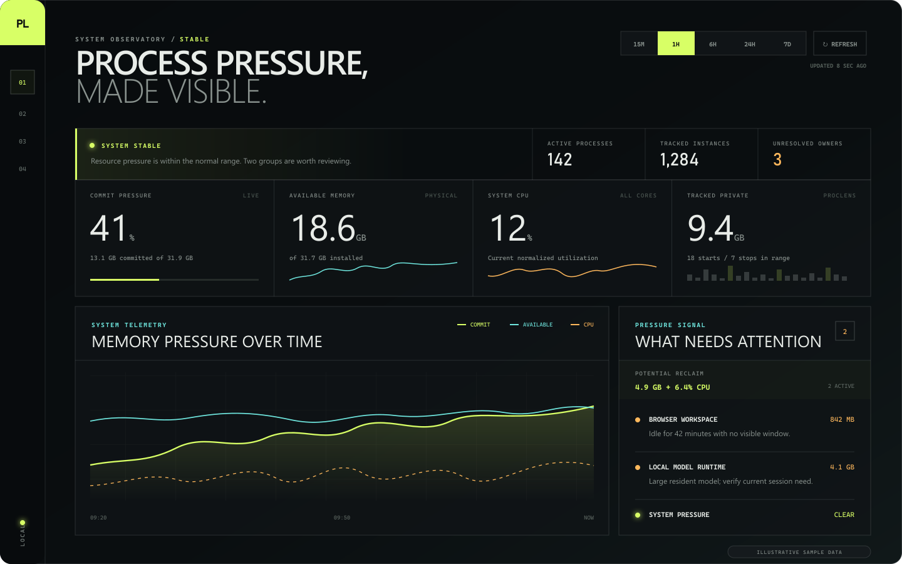
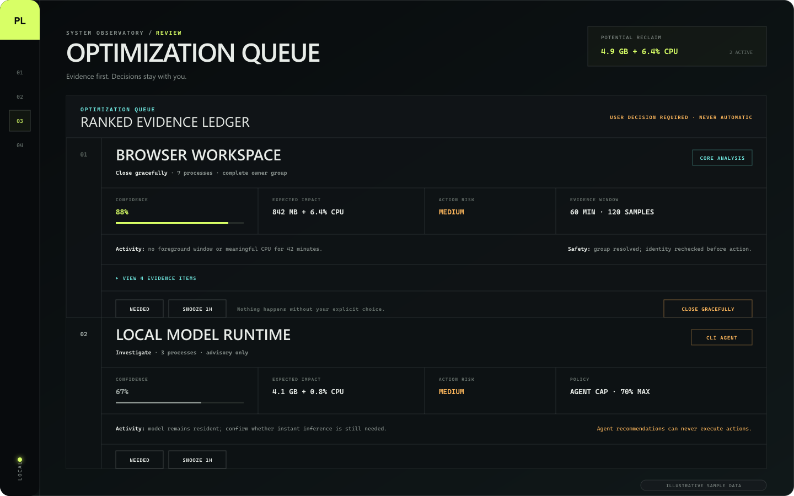

<div align="center">

# ProcLens

### Process pressure, made visible.

Local-first Windows process history, session ownership, and evidence-based
resource recommendations—without cloud telemetry or automatic process killing.

[](https://github.com/przemekzur/procWatch/actions/workflows/ci.yml)
[](https://github.com/przemekzur/procWatch)
[](https://dotnet.microsoft.com/)
[](LICENSE)

</div>



<p align="center"><sub>Dashboard shown with illustrative, privacy-safe sample data.</sub></p>

ProcLens answers the questions Task Manager cannot answer after the moment has
passed: **where did the memory go, what launched, which session owns it, and is
it safe to close?** It runs quietly in the notification area, builds a local
history, and serves its dashboard only on your machine.

## Why ProcLens?

| Capability | What you get |
| --- | --- |
| Historical pressure | Physical memory, commit, CPU, I/O, handles, threads, starts, and stops across collector runs and reboots |
| Process genealogy | Related processes grouped into applications and coding or desktop sessions |
| Evidence-led recommendations | Confidence, expected impact, activity, risk, and supporting evidence kept separate |
| Conservative actions | Explicit user decisions, graceful close only, and identity/safety revalidation immediately before action |
| Agent-ready analysis | Privacy-safe JSON snapshots and a bundled skill for CLI agents to publish advisory findings |
| Local by design | Loopback-only dashboard, per-install token, local SQLite history, and no telemetry |

ProcLens is intentionally narrower than Sysinternals Process Monitor. It is a
low-overhead historical resource and ownership tool—not a file or Registry
tracer.

## Optimization without guesswork



Every recommendation keeps three separate ideas visible:

- **Confidence** — evidence that the group is currently unnecessary.
- **Impact** — an estimate of memory or sustained CPU that may be recovered.
- **Risk** — a safety gate that can block an otherwise high-impact action.

The queue is never an automatic optimizer. ProcLens does not expose force
termination. Before a graceful close, it rechecks the PID and start time plus
all current safety rules. System, service-like, session-0, foreground, recently
started, unresolved, changed-identity, `neverEnd`, and ProcLens-owned targets
are blocked.

CLI agents are advisory-only. Agent confidence is capped at 70% until core
ProcLens evidence corroborates it, and imported agent advice can only request
`investigate`—never an executable action.

## Install

ProcLens currently builds from source. You need Windows 10 or 11 and the
[.NET 10 SDK](https://dotnet.microsoft.com/download/dotnet/10.0).

```powershell
git clone https://github.com/przemekzur/procWatch.git
cd procWatch

dotnet restore ProcLens.csproj --locked-mode
dotnet publish ProcLens.csproj -c Release -r win-x64 --self-contained true --no-restore -o artifacts\win-x64
.\artifacts\win-x64\ProcLens.exe install
```

For Windows on Arm, replace `win-x64` with `win-arm64`. The installer copies
the self-contained app to `%LOCALAPPDATA%\Programs\ProcLens`, enables per-user
startup, and launches the tray application. No separate .NET runtime is needed
after publishing.

To remove startup registration while preserving history:

```powershell
ProcLens.exe uninstall
```

## Use

ProcLens starts in the Windows notification area without opening a terminal.
Double-click the tray icon to open the dashboard. The tray menu can pause
collection, open the data folder, show diagnostics, toggle startup, or exit.

Useful commands:

```powershell
# Open the authenticated local dashboard
ProcLens.exe dashboard

# Verify configuration, storage, and collector health
ProcLens.exe doctor

# Export a privacy-safe analysis window
ProcLens.exe agent-snapshot --minutes 60 > snapshot.json

# Inspect or import advisory recommendations
ProcLens.exe recommendations list > recommendations.json
ProcLens.exe recommendations import --file advisory.json --minutes 60
```

Persistent settings live at `%LOCALAPPDATA%\ProcLens\settings.json`. History is
stored in `%LOCALAPPDATA%\ProcLens\data\proclens.db` and retained for 14 days by
default.

Process actions are disabled by default. To make eligible **Close gracefully**
buttons available, set `"processActionsEnabled": true` in `settings.json` and
restart ProcLens. All safety blocks continue to apply.

## Agent workflow

The bundled [`proclens-process-advisor`](skills/proclens-process-advisor/SKILL.md)
skill gives Codex-compatible CLI agents a strict workflow for slow-PC
investigation:

```text
ProcLens snapshot → agent analysis → schema validation → policy recomputation
                  → dashboard advisory → user decision
```

Copy `skills\proclens-process-advisor` to
`%USERPROFILE%\.codex\skills\` and restart the CLI session. The skill validates
advisories before import and refuses stale, malformed, incomplete,
overconfident, or unsafe submissions.

See the [agent contract reference](skills/proclens-process-advisor/references/contracts.md)
for the versioned JSON schemas and policy boundaries.

## Privacy and trust model

ProcLens sends no telemetry and binds only to `127.0.0.1`. Its API validates
the local Host header and requires a random per-install token. By default it
does **not** store command lines, executable paths, machine names, user names,
or environment variables.

| Boundary | Guarantee |
| --- | --- |
| Network | Dashboard and API listen on loopback only |
| Authentication | Random token generated for each installation |
| Collection | Sensitive fields are opt-in and disabled by default |
| Decisions | Recommendations never trigger actions automatically |
| Execution | Graceful close only; no force-terminate feature |
| Agent access | Privacy-safe snapshots in, non-executing advisories out |

Read the full [privacy policy](PRIVACY.md), [security policy](SECURITY.md), and
[security audit](SECURITY_AUDIT_REPORT.md).

## Classification rules

Generic application rules are defined in `rules.default.json`. To add or
override classifications, create
`%LOCALAPPDATA%\ProcLens\rules.json`; custom rules are evaluated before the
defaults and take effect after restart.

`rules.viricrew.example.json` demonstrates process-name, command-substring,
regular-expression, and owner-root rules. Keep local rule files free of secrets
and complete private command lines.

## Develop

```powershell
dotnet restore ProcLens.csproj --locked-mode
dotnet build ProcLens.csproj -c Release -p:TreatWarningsAsErrors=true --no-restore

dotnet restore tests\ProcLens.Tests\ProcLens.Tests.csproj --locked-mode
dotnet test tests\ProcLens.Tests\ProcLens.Tests.csproj -c Release --no-restore
```

Run the development build with:

```powershell
dotnet run -c Release
```

Please read [CONTRIBUTING.md](CONTRIBUTING.md) before opening a pull request.
Contributions should preserve local-only operation, privacy-safe defaults, and
the conservative action model.

## License

ProcLens is available under the [MIT License](LICENSE).
